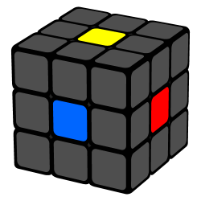
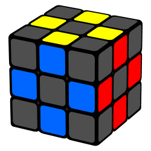
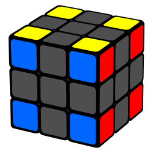

# Aprenda a resolver o Cubo Mágico  

Utilizando um método mais fácil, conhecido como:

"Método de Camadas"

Considerada a maneira mais fácil, que qualquer pessoa consegue
## Acesse o arquivos abaixo

 - [Método de Camadas](https://github.com/andff/CuboMagico/blob/9509ddb2da3465dd077ceab1ec61f85097c409a8/M%C3%89TODO%20DAS%20CAMADAS.txt)
 
## O cubo mágico possui 3 tipos de peças diferentes, sendo elas:                       

  
  

